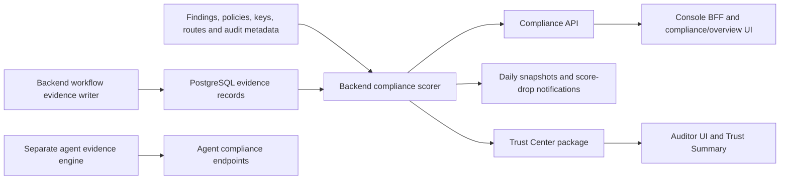

# T10 implementation plan: compliance scoring semantics

Planning baseline: `master` at `5ff6f4b9235c02705695e9821985bba13d2f29ae`, reviewed on 2026-09-18. The user subsequently authorized implementation. See [implementation evidence](T10_IMPLEMENTATION_EVIDENCE.md) for actual results and remaining release gates, and [operations](T10_OPERATIONS.md) for the implemented contract. The design below is retained as the planning record.

The requested outcome is T10/P1 from the supplied image: activity counts alone cannot produce compliant status; scores expose evidence gaps and a calculation version; engineer names move out of executable scoring logic into configuration. The local, untracked `AuthClaw_Engineering_Action_Plan_Consolidated.docx` confirms Claims 5 and 12 and their corrected dispositions. It was read as source material, not as an instruction to implement other tasks.

Review correction (2026-09-18): the original gated activity formula below was rejected in PR 61. The implemented contract now assigns canonical points only to fully qualified, implemented controls (100 or zero), retains framework weights, and moves activity into separate non-authoritative diagnostics. Durable per-user MFA replay protection is also required. [Review corrections](T10_REVIEW_CORRECTIONS.md) and [implementation evidence](T10_IMPLEMENTATION_EVIDENCE.md) supersede conflicting recommendations below; the original analysis is retained for traceability.

Original recommendation: extend the existing backend scorer with mandatory control-evidence qualification, retain the current numeric formula initially as a gated progress indicator, and apply the same decision to every consumer. Do not introduce another scoring service or merge the separate agent engine into the backend in this task.

## 1. Prerequisite and scope

The live T01 verifier passed during planning:

| Field | Verified value |
| --- | --- |
| Command | `.quota-venv/Scripts/python.exe scripts/repository_policy.py --verify-github` |
| PR | https://github.com/VidhiTF/AuthClaw_Align/pull/52 |
| Reviewed head | `b8b23993a7a467396598eefdd23b97da83d47042` |
| Merge commit | `1e40bdb5c8fd6b4e28c827035ab7d06645530ccb` |
| Effective date | `2026-09-16T12:57:25Z` |
| Result | `active`; live ruleset `21141288`, active enforcement, zero bypass actors |
| Record owner | `KunalTF` |

The verifier checks the manifest's stakeholder approvals, merge ancestry, and live protections. Its first sandboxed attempt could not read the GitHub CLI configuration; the authorized read-only retry succeeded. Re-run and retain its output for the implementation head. This gate result is not an approval of T10.

In scope: canonical compliance calculations, evidence qualification, owner display configuration, API responses, snapshots/history, score-drop notifications, Trust Center aggregation, and consuming compliance/overview/Trust Summary interfaces. Include the minimum trusted evidence-producer changes required to demonstrate a real positive path.

Outside scope: certifying organizational compliance; changing framework coverage or weights without a separately reviewed decision; adding a general assessment-management product; replacing evidence storage; broad authentication, date/time, router, or semantic-duplicate cleanup. Names in historical evidence, governance documents, and CODEOWNERS are not runtime ownership defaults and must not be rewritten indiscriminately.

## 2. What the current architecture actually does

- `backend/app/services/compliance_scoring.py` is the existing authority for `/v1/compliance-scores`, individual frameworks, history, and the backend Trust Center. The catalog has 8 SOC2, 4 GDPR, and 4 HIPAA controls.
- `collect_metrics()` counts tenant/framework records; several inputs are tenant-wide rather than specific to a control or assessment period. `_signal_score()` rewards active keys, routes, policies, event volumes, hashes being present, and absence of open findings/pending approvals.
- `score_control()` averages those signals. Existing gaps and non-`built_in` implementation states cap a control at 84.9 and prevent `compliant`. These protections are useful and should be preserved.
- `score_framework()` adds a missing-evidence gap only when the sum of matching evidence, finding, and audit-event counts is zero. `_control_traceability()` matches free text with `ILIKE`; it does not qualify evidence integrity, freshness, outcome, or operational provenance.
- Evidence creation already provides a useful reuse seam: `backend/app/services/evidence_service.py`, invoked through `backend/app/orchestrator/runner.py`. `backend/app/core/evidence_integrity.py` hashes record identity, tenant, source, payload, and timestamp. Migration 038 makes evidence records immutable; integrity verification is used by evidence API serialization but not by scoring.
- Daily snapshots retain control payloads but have no calculation version. Their unique key is tenant/framework/date. Read endpoints can persist snapshots by default; the console explicitly requests `persist_snapshot=false`.
- Console pages and the Trust Summary consume backend scores. The Trust Center filters allowed frameworks and then recomputes overall readiness from the numeric mean alone.
- There is also an independent agent scoring path in `services/agent/services/compliance_evidence_engine.py`, exposed by routes in `services/agent/main.py`. Its catalog, tenant representation, tables, and status vocabulary differ from the backend. Repository search found no direct console call to its `/compliance/framework-scores` route; deployed/external reachability is unverified.

## 3. Findings and consequences

| Finding | Evidence | Consequence / disposition |
| --- | --- | --- |
| Activity can still appear compliant | `_signal_score()` and `score_control()`; direct service reproduction produced CC7.2 = 100.0 / `compliant` from the existing test metrics | Claim 5 confirmed at the service seam; high product/compliance semantics risk, not merely display debt |
| A matching audit event or finding satisfies the evidence gate | `score_framework()` sums all three traceability counts; substituting `(evidence=0, findings=0, audit=1)` or `(0,1,0)` preserved CC7.2 = 100.0 / `compliant` | A record about a control is treated as evidence that it works; a finding can even help satisfy the presence gate |
| Traceability matching is too broad for qualification | `_control_terms()` emits `164` and `312` for HIPAA access control; substring matching also admits prefix collisions | Wrong-control records can satisfy the check. Free-text drilldown must not decide compliance |
| Traceability omission changes semantics | `include_traceability=False` skips the operating-evidence check; service reproduction returned CC7.2 compliant | Latent API/internal-call risk. Current production callers inspected use traceability; do not describe this as the Trust Center's active path |
| Filtered Trust Center readiness can be promoted incorrectly | Service fixture produced SOC2 = 94.0 / `monitor`, while `readiness_level(94.0)` returns `audit_ready`; `build_public_package()` uses the latter after filtering | Auditor-facing readiness can contradict control gaps. This is part of the same outcome contract |
| Evidence records are not automatically successful assessments | Records include detections, policy violations, generic audit records and approvals; hashes establish integrity, not successful operation | Valid hashes, many records, or a string such as `result=pass` are insufficient without a trusted, control-specific assessment contract |
| Accepted risk is counted as resolved | `RESOLVED_STATUSES` includes `ACCEPTED_RISK` | Acceptance of a risk must remain an exception; it is not proof of remediation or control effectiveness |
| Ownership is compiled into responses | SOC2 catalog entries contain named engineers; API and console render the arrays | Claim 12 confirmed: brittle configuration and unnecessary personal-name exposure |
| Version transitions are currently invisible | No version in live response, snapshot model, or history; score-drop alerts compare numeric values | A semantic correction can overwrite a same-day result and trigger misleading deterioration alerts |
| Separate agent scorer starts from 100 | `ComplianceEvidenceEngine.calculate_scores()` initializes each control to 100 and subtracts negative impacts; no evidence leaves it `passing` | Adjacent, source-confirmed risk. Product-wide T10 completion requires resolving whether this remains an exposed compliance surface |

These are local code/service findings. They do not establish production data prevalence or deployed behavior.

## 4. Intended calculation contract

### Separate qualification from activity

Retain weights and the existing signal formula in the first T10 release to bound numerical and compatibility changes. Describe the result as an **evidence-gated readiness/progress score**, not percentage compliance or evidence coverage. Activity totals remain diagnostic context and cannot qualify a control.

For each control, evaluate mandatory evidence requirements first. A control is `compliant` only if all of the following hold:

1. Its approved implementation mapping is complete under the current catalog. Preserve the existing block for `partial`, `gap`, and `not_mapped`; do not silently mark unmapped GDPR/HIPAA controls implemented.
2. Every required assessment has an exact tenant/framework/control binding, trusted provenance, a valid integrity version/hash, a successful outcome, the required scope/period, and current validity.
3. There is no blocking finding, failed assessment, unresolved exception, or unsupported assessment requirement. Accepted risk remains visible and blocking for an unqualified compliant label. Validated false positives need their existing disposition evidence; a status string alone must not become positive proof.
4. The existing numeric threshold is met.

Any blocking gap prevents `compliant` and caps the numeric control score at 84.9. Preserve lower scores and current `partial`/`non_compliant` values for compatibility. Unmapped evidence and unassessed controls remain explicitly unknown/missing in added evidence metadata; the UI must not imply that missing evidence is a demonstrated control failure.

Framework `audit_ready` requires the existing numeric threshold **and every required control qualifying**. Overall readiness applies the same invariant to every framework in the response. An empty scope or an incomplete calculation is never audit-ready. The shared aggregation rule must also run after Trust Center framework filtering.

The choice to retain the heuristic is deliberate. A later replacement with evidence-coverage scoring requires its own reviewed calculation version; do not quietly reinterpret the existing percentages during T10.

### Qualify evidence through existing storage

Use a small, validated `control_assessment` envelope inside `EvidenceRecord.evidence_data`, already covered by the record hash. Proposed fields: envelope version, exact control ID, requirement ID, outcome (`pass`, `fail`, `unknown`), observed time, covered period/scope, environment, producer/version, immutable source references, and review/disposition reference when required. The record supplies tenant and framework; mismatches are rejected. Hash and schema version checks are mandatory.

The envelope is a proposed contract, not something current producers already guarantee. Only a trusted backend adapter may construct it from verified source facts. Validate the producing workflow/service identity and any referenced approval/review against stored tenant-scoped records. Never promote caller-supplied metadata, uploaded prose, model output, a severity of `info`, or an asserted reviewer name directly into a passing assessment. A self-consistent SHA-256 hash proves record integrity, not issuer authenticity.

Implementation must demonstrate at least one qualifying control through the actual writer and scorer, plus an invalid/untrusted producer case. Do not finish with a synthetic-only positive path or an API that can never qualify real evidence. Where an operational collector/review path does not exist, expose `unsupported_requirement` and keep the control blocked; record the exact missing producer dependency.

Use exact catalog IDs in this hashed payload. Keep `source_reference` and existing traceability links for navigation. Legacy free-text references and mutable `EvidenceLink` rows cannot by themselves confer qualification. Do not mutate immutable historical evidence to manufacture assessment metadata; issue a new, linked assessment only after revalidation.

Deduplicate by assessment/source identity, not row count. Select the effective assessment deterministically by verified observation time and an explicit supersession rule. A newer failed assessment invalidates an older pass for the same requirement; a duplicate pass cannot erase a failure. Unknown or unsupported provenance cannot establish supersession. Negative findings remain independently blocking until their disposition is validated.

Define validity by requirement, with an explicit `as_of` in UTC. Reject future observations, missing required timestamps, expired assessments and wrong-environment records. Local/test records cannot qualify a production assessment. Evaluate all controls against one captured time and one consistent database read view; an identical `generated_at` string alone is not a database snapshot.

For performance, collect qualifying inputs once per tenant/framework and derive control decisions without the per-control drilldown queries. Detailed traceability stays optional and bounded to its existing display limits; eligibility never depends on those limits. Do not scan only the latest five rows to decide compliance, or assume a database error means zero findings. Return an explicit unavailable response without persistence/alerts if required data cannot be read.

### Control requirements to approve before coding

Populate concrete requirement IDs, accepted producers, required period, expiry policy and negative cases for all 16 catalog controls. Do not invent one universal freshness interval. Start from the existing control matrix and operating-evidence rules:

| Control group | Required evidence direction; not a claim that these collectors already exist |
| --- | --- |
| SOC2 CC6.1 / C1.1 | Reviewed access/isolation/configuration outcomes, with environment scope and negative tests as applicable |
| SOC2 CC6.6; HIPAA transmission | Validated transport/redaction enforcement outcomes, not token row counts |
| SOC2 CC7.1 | Actual release/security scan results and recorded disposition of blocking findings |
| SOC2 CC7.2 | Scoped monitoring operation and triage/review evidence, not a log-volume threshold |
| SOC2 CC7.3 | Finding closure/retest/approval evidence; retain outstanding and accepted-risk exceptions |
| SOC2 CC8.1 | A bound change, authorization, review, checks and release record |
| SOC2 A1.2 | Actual backup/restore/recovery test outcomes |
| GDPR / remaining HIPAA controls | Approve control-specific evidence using the current mapping; preserve `not_mapped` where implementation/operational coverage is absent |

Security/compliance owners must approve these engineering acceptance definitions before a label is permitted. They are internal readiness criteria, not a legal determination.

## 5. Ownership configuration

Keep stable role identifiers in catalog entries (for example, platform security, agent engineering, release governance). Resolve display names through a validated backend setting in the existing `Settings` infrastructure, such as `COMPLIANCE_OWNER_MAP_JSON`, keyed by role and optionally exact framework/control.

- Preserve `product_owners` and `operational_owners` as arrays for existing clients. Add configuration revision/source metadata only where useful for diagnosis; never expose the whole configuration.
- Missing configuration produces neutral role labels or `Unassigned`, never a named-engineer fallback. Malformed configuration fails validation with sanitized diagnostics. Absence of an operational owner is a visible ownership gap where the approved requirement requires one; a generic label is not evidence of assignment.
- Configuration is deployment-scoped in T10, matching the current global product ownership semantics. It must not pretend to represent different tenants' employees. A tenant-specific assignment UI/database model would be separate scope.
- Separate internal display names from approved public role labels in the Trust Center projection. Configured personal names should not automatically appear in an auditor package. Keep historic snapshot data intact under existing access/retention rules.
- Validate unknown control/role keys, value types, lengths and empty overrides. Use neutral fixtures/examples. Changes to display-only names cannot affect evidence qualification or numeric scores.
- Document injection in existing environment/deployment examples. No new configuration service, secret dependency, runtime network lookup, or administrative endpoint is needed.

## 6. API, versions, persistence and consumers

Add `calculation_version` to aggregate, framework, Trust Summary and history responses. Control results inherit that version and carry structured evidence assessment metadata: state, reason codes, required/qualified counts, `as_of`, and validity information. Keep existing `gaps`, `exceptions`, `evidence`, status enums and owner arrays during the compatibility window. Extend Pydantic response models explicitly so serialization does not discard the new fields.

Suggested stable reasons include `missing_assessment`, `wrong_scope`, `stale_assessment`, `invalid_integrity`, `untrusted_source`, `failed_assessment`, `open_finding`, `accepted_risk`, `implementation_incomplete`, and `unsupported_requirement`. Preserve readable messages for old clients. Detailed internal provenance must stay within current authorization/share boundaries.

Make the calculation version an immutable identifier for the algorithm plus the reviewed evidence policy/catalog definition. Do not derive it from today's date or accept it from clients. Any threshold, weight, qualification or validity-policy change changes this identifier; archive the corresponding definition with the release. Owner display-only configuration gets a separate revision if recorded.

Extend `ComplianceScoreSnapshot` with calculation version and assessment metadata (`as_of`, policy reference and sufficient bounded decision inputs/references to explain the saved outcome). Preserve historical snapshots as `legacy_unversioned`; do not label old results as v2 or fabricate missing provenance. Existing control JSON can hold per-control decisions, avoiding a new snapshot table.

Change daily identity to tenant/framework/date/calculation-version so different methods can coexist on one date. Use an atomic database upsert against that constraint and version-scoped previous-result selection. The existing select-then-insert can race; make concurrent snapshot and alert behavior part of the verification, not a separate cleanup project. A transaction winner should generate at most one alert for the persisted transition.

Compare score-drop notifications only within a calculation version and comparable scope. Crossing versions creates a method-change annotation, not a compliance deterioration alert. A genuine drop within a version must still alert. Do not rewrite the signed audit-export format: it currently exports audit evidence, not this score calculation. Verify existing export access remains isolated and that any consumer embedding scores retains version metadata.

Update compliance and overview pages, `console/src/lib/trust-summary.ts`, the Trust Summary component, and `console/src/app/trust-center/[token]/page.tsx` to show the calculation version, evidence state and meaningful gaps. Distinguish activity signals from qualified evidence. Explain that the existing `Verified` group means the application's criteria, consistent with `docs/COMPLIANCE_BOUNDARY.md`. Do not recalculate classifications in JavaScript.

History should visibly break at version changes. Its item keys must include version or snapshot ID, not just framework/date. With multiple versions per day, apply a real UTC date-window filter and deterministic ordering; the current row-count-based `days` limit is insufficient. Older responses without a version render as legacy/unknown, never as the new method. Stale/error UI must not continue presenting old green status as a fresh result.

## 7. Tenant and trust boundaries

For private endpoints, the tenant key is `request.state.tenant_id`, established from vetted credentials and rebound by `get_tenant_db()`. All assessment, finding and snapshot queries must retain explicit tenant filters. At this baseline, migration 041 replaced older GUC policies with forced RLS using `authn.current_tenant_id()` for both `USING` and `WITH CHECK`; do not rely on migration 020's older policy text as the current control.

Use the restricted application database role for negative tests, with owner access only to prepare fixtures. Verify read, insert, update/upsert and history isolation independently from API authorization. For evidence links and referenced reviews, both the referencing and referenced object must belong to the authenticated tenant.

The Trust Center takes scope from the resolved, verified share rather than a request tenant parameter. Reverify its actual database access path and framework allowlist. No qualification or ownership projection may expose another tenant's data, disallowed framework details, internal reviewer identifiers or source payloads. Add scoped-package/export tests; no new similarity-search operation is proposed, so that portion is N/A with this reason.

## 8. Dependency-ordered implementation sequence

1. **Freeze the contract and baseline evidence.** Re-run T01; retain Claim 5/12 disposition and the current reproductions. Approve the 16-control requirement matrix, owner roles/public projection, version definition, and agent-path scope. Establish the full locked test environment. No production edits before these contract decisions are recorded.
2. **Characterize and prove the missing invariants.** Extend existing scoring and Trust Center tests first: counts-only, audit/finding-only, wrong-control text, traceability parity, and filtered readiness must fail for the current mechanism. Preserve valid tenant, error, catalog, numeric and serialization behavior. Use neutral ownership fixtures.
3. **Deliver one evidence-qualified vertical slice.** Validate and persist one real assessment through the existing evidence writer, verify it in the scorer, expose a structured gap/decision through the real API and one UI detail. Prove fail-to-pass-to-fail transitions, including tamper and stale data. Reuse the existing integrity function and immutable record contract; add only the missing validation/qualification logic.
4. **Apply the contract across the catalog and callers.** Implement the reviewed requirement map for all controls; unsupported requirements explicitly block. Separate display traceability from qualification. Resolve configured ownership. Apply common readiness rules to framework, aggregate, Trust Center and Trust Summary outputs. Preserve version/time consistency and fail-closed data-source behavior.
5. **Make history and notifications version-aware.** Add the next migration after the actual repository head (049 at this baseline; do not preallocate a revision that may conflict), snapshot columns/identity, atomic persistence, version-aware notification comparison and date-window history. Test migration from real legacy-shaped rows and concurrent same-day requests.
6. **Complete consumers and documentation.** Update types/rendering and legacy fallbacks, history keys and version annotations, public role projection, environment examples, control matrix and compliance-boundary wording. Keep BFF route behavior and existing signed audit exports compatible. Run the release-scope check on the separate agent engine.
7. **Integrate, review and release.** Run the acceptance matrix below, attach actual counts/results to the existing PR template, obtain component/security/consumer/governance approvals as applicable, and perform the staged cutover. Do not mark T10 complete from unit results or this plan alone.

Each step depends on the prior contract. Keep one coherent T10 review scope; split commits/PRs around contract preparation, backend/schema behavior, and consumer rollout only when intermediate states are safe. No semantic-duplicate consolidation is proposed. If that changes, the repository AST/cluster/approval protocol applies before merging logic.

### Separate agent scorer: release decision

Do not silently claim that changing the backend fixes all AuthClaw scoring. Inventory registered canonical/compatibility routes, configured proxies, SDK/external consumers and exported packages for the agent engine. If it remains reachable as a compliance-authoritative surface, T10 release must either apply equivalent fail-closed semantics/version metadata in a separately reviewed bounded change, or retire/disable that exposure with a documented compatibility response. If it is demonstrably diagnostic-only, label and document that boundary and prove that no readiness/Trust Center consumer uses it. Keep differing tenant models explicit; do not forward integer tenant IDs into UUID backend queries. Replacing or merging this engine is not an implicit part of T10.

## 9. Verification required for acceptance

| ID | Required evidence | Best test seam |
| --- | --- | --- |
| T10-01 | Empty tenant and arbitrarily large activity counts never yield compliant/verified/audit-ready without qualified assessments | Existing scorer unit tests; real API integration |
| T10-02 | Generic evidence, matching audit text, finding-only records, wrong control/framework/environment, and substring collisions cannot qualify | Qualification unit tests plus PostgreSQL query integration |
| T10-03 | Exact, current, integrity-valid evidence from a trusted writer qualifies a fully implemented control; adding a failed/stale/tampered assessment removes qualification | Real writer-to-scorer-to-API test, not only mocked metrics |
| T10-04 | Missing, future, expired, unsupported-version, duplicate, out-of-order, superseded and conflicting evidence behaves deterministically | Fixed-clock qualification tests with independent expectations |
| T10-05 | Open findings, accepted risk, incomplete implementation, missing reviews and unsupported requirements remain visible/blocking | Existing finding/assessment fixtures and control tests |
| T10-06 | Traceability on/off, aggregate vs single-framework API, Trust Summary and allowed-framework Trust Center agree on status and version | Service/response/consumer contract tests |
| T10-07 | Data-source/configuration failure never returns a fresh success, saves a bogus snapshot, or sends a score-drop alert | Fault-injection service/API tests |
| T10-08 | Owners change through configuration; missing/invalid config is safe; named engineers are absent from executable defaults and public packages | Settings/catalog/API tests with neutral fixtures; targeted source scan |
| T10-09 | Old history stays legacy, new version is persisted/exposed, same-day versions coexist, window filtering is correct, and concurrent writes are idempotent | PostgreSQL migration/persistence tests |
| T10-10 | Method changes do not emit deterioration alerts; real same-version decreases still do; concurrent requests do not duplicate one transition's alert | Snapshot/notification transaction tests |
| T10-11 | Cross-tenant reads/inserts/updates/history and linked-review access are denied at API and restricted-role database layers | Extend `backend/tests/test_tenant_isolation.py`; no privileged runtime role |
| T10-12 | Shared package/export respects tenant/framework/access scope and public owner projection | Extend Trust Center and audit-export access tests |
| T10-13 | Console shows version, missing/stale evidence and method-change history; no old green state is presented as fresh after an error | Rendered browser tests with API fixtures; existing source-contract tests are supplementary |
| T10-14 | Query count is bounded independently of per-control detail requests; representative large-tenant latency/memory and payload size meet the agreed budget | Compare before/after PostgreSQL query/latency measurements |
| T10-15 | Every remaining exposed scoring path is identified and cannot issue an unsupported affirmative compliance label | Agent route/consumer inventory and scoped contract tests |

Extend `backend/tests/test_compliance_scoring.py`, `test_acl19_continuous_evidence.py`, `test_trust_center.py`, tenant isolation and endpoint suites; use the existing migration-test pattern for snapshot changes. Add config or persistence files only if the existing test seams become unclear. Inspect the explicit CI test selection so necessary tests actually run.

After implementation, run the focused backend tests in the repository's fully installed locked environment, then selected endpoint/database suites, console unit/claims checks, type/lint/build checks and the browser scenarios. Use disposable PostgreSQL with the repository's destructive-test safety guard. Record skipped checks separately from passes. No production dataset or live database migration is authorized by this planning request.

## 10. Rollout, rollback and engineering consequences

- **Expected score/status reductions:** customers may lose green controls because evidence was never qualified. Capture before/after explanations and notify release/support stakeholders through normal release notes. Do not relax the new gate to preserve old scores.
- **Evidence availability:** many controls may initially be blocked. Publish the required evidence/producer list; product metadata, configuration presence and test fixtures cannot substitute for operating evidence.
- **Schema compatibility:** first add version/metadata columns with a legacy designation and deploy tolerant readers. Do not allow old and new snapshot writers to overlap during the uniqueness/semantics cutover: old code selects by tenant/framework/date and could overwrite another version. Retire/drain old writers, complete the new uniqueness constraint and activate the new scorer in a controlled cutover. If continuous rolling snapshot writes are mandatory, design and test an explicit writer-compatibility layer before release; the simple migration does not provide one.
- **Read/write effects:** exercise both `persist_snapshot=false` and the existing default persistent read. Capture qualification from a consistent read view and ensure persistence/notifications occur after a complete valid calculation. Do not introduce a scheduled snapshot job or change the public HTTP method in this task.
- **Canary:** compare stored inputs, gap reasons, versions, public projection, latency and notification counts using approved fixtures/staging data. Ensure all serving instances use the same reviewed policy version before general exposure. Promotion requires the negative cases as well as a valid positive path.
- **Rollback:** retain additive schema/history and immutable evidence. Before cutover, a compatibility-reader rollback is straightforward. After v2, prefer a forward fix; if service must roll back, suppress affirmative score surfaces/snapshot writes and show temporarily unavailable until a safe version is restored. Do not re-enable known count-only compliant claims, relabel v2 rows as legacy, delete v2 snapshots, or downgrade away retained evidence. A schema downgrade needs a separate data-retention/recovery decision.
- **Performance:** qualification adds validation and reads. Reuse a bounded collection pass and existing indexes first; add an index only from query-plan evidence. Avoid a cross-request cache until expiry, tenant, version and policy invalidation are proven.
- **Line growth:** this planning change adds zero production lines. Implementation must report actual additions/deletions and Tokei 12.1.2 counts using `scripts/check_line_budget.py` for every required scope. Do not claim the budget check passed here. At 100 positive net non-prose lines summed per growing file, follow the existing current-head owner approval/digest rule; unrelated deletions cannot offset it.

Review follows current CONTRIBUTING/CODEOWNERS: backend/platform/security primary `KunalTF`, deputy `VidhiTF`; console/consumer primary `RaviiTF`, deputy `VidhiTF`; agent owner `VidhiTF` if that boundary changes; governance custodians for CI/policy changes. Require two independent human approvals with the necessary boundary/consumer roles, using a deputy where the primary is the author. Existing architectural documents contain older approval language; current repository governance controls this change. No approval is recorded as complete by this plan.

## 11. Evidence actually collected during planning

| Check | Fresh result and limits |
| --- | --- |
| T01 activation verifier | Exit 0; active, merge and protection details above |
| Direct import of the existing scorer; existing test metrics; controlled traceability totals | Exit 0. CC7.2 from counts = 100.0/compliant; zero trace totals cap it to 84.9/partial; one matching audit or finding restores compliant; SOC2 = 94.0/monitor while numeric-only readiness = audit_ready; traceability-off returns compliant. Metrics and query results were substituted; no database/HTTP/deployed proof is claimed |
| `backend`: `../.quota-venv/Scripts/python.exe -m pytest tests/test_compliance_scoring.py tests/test_acl19_continuous_evidence.py tests/test_trust_center.py -q -p no:cacheprovider` | Blocked at collection: local environment lacks `langgraph` used by shared conftest |
| Same test selection with `--noconftest` to isolate imports | Still blocked at collection: missing `pyotp` and `jwt`; not a test pass |
| `backend`: `../.quota-venv/Scripts/python.exe -m pytest --noconftest tests/test_acl19_continuous_evidence.py -q -p no:cacheprovider` | 2 passed; only deterministic/tenant-bound hashes and tamper detection, with shared conftest intentionally bypassed |
| `console`: `node --test --experimental-strip-types --disable-warning=MODULE_TYPELESS_PACKAGE_JSON tests/acl19-ui-contract.test.mts tests/trust-summary.test.mts` | 7 passed; source/UI contract and Trust Summary helper checks, not browser-rendered behavior |
| Source/consumer/schema inspection | Completed for the cited paths; no PostgreSQL integration, migration, concurrency, full build, benchmark, or production verification performed |

The untracked source document was left unchanged. No production code, tests, dependencies or deployment configuration were edited. The design is ready for review; implementation, exact per-control evidence policy, external agent-path reachability and end-to-end verification remain to be completed.
