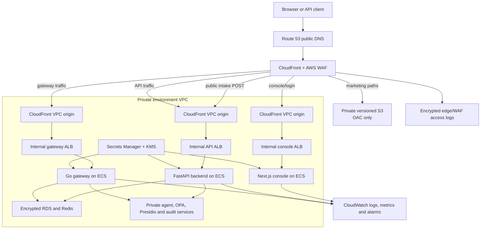

# ADR-0002: AWS URL and environment boundary

- Status: Proposed — pending Binod approval
- Decision date: 2026-07-13
- Owners: Kunal (AWS infrastructure, application routing, deployment and rollback), Binod
  (decision and production promotion), Ravi (marketing and console), Vidhi (agent services)
- Dependencies: ACL-6, ACL-14

## Context

AuthClaw needs a stable URL contract before AWS infrastructure and website integration
begin. The contract must keep controlled early access isolated from production, expose
only protected edge endpoints, and give operators an unambiguous deployment and rollback
path.

[ADR-0001](0001-canonical-monorepo-component-boundaries.md) is the upstream
canonical-codebase decision. It identifies this consolidated monorepo and the approved
implementation boundary for every overlapping component. This ADR consumes those choices
and does not reopen them.

The current Terraform is a baseline, not an implementation of this ADR. It creates a
public ALB with separate listeners for the console, backend, and gateway. ACL-14 must
replace that public-origin model with the private-origin edge described below before this
ADR can move from **Accepted** to **Implemented**.

## Decision

### Environment boundary

| Environment | Public entry point | Purpose | Data and credentials |
| --- | --- | --- | --- |
| Staging / controlled early access | `https://dev.authclaw.ai` | Pre-production validation and invited early-access users | Staging-only AWS account, VPC, databases, KMS keys, secrets and provider credentials |
| Production marketing | `https://authclaw.ai` and `https://www.authclaw.ai` | Public marketing content only | No application credentials or customer data |
| Production application | `https://app.authclaw.ai` | Login and authenticated console, enabled only after go/no-go | Production-only AWS account, VPC, databases, KMS keys and secrets |

Staging must never connect to production databases, caches, buckets, queues, KMS keys or
Secrets Manager entries. Synthetic or explicitly consented test data is used in staging.
Production access is not granted to staging workloads or CI roles.

### URL and routing contract

| URL | Route | Destination | Authentication | Cache policy |
| --- | --- | --- | --- | --- |
| `dev.authclaw.ai` | `/`, marketing pages, `/demo`, `/early-access` and static assets | Staging marketing S3 origin through CloudFront Origin Access Control (OAC) | Public | Versioned static assets may cache; HTML uses short TTL |
| `dev.authclaw.ai` | `/login`, `/invite/accept`, `/auth/callback`, `/logout`, `/trust/shared/*` and authenticated console routes | Staging Next.js console on ECS through a CloudFront VPC origin and internal ALB | Public entry; invitation and authenticated routes enforce application authorization | No shared cache for personalized responses |
| `dev.authclaw.ai` | `POST /api/public/v1/access-requests` | Staging FastAPI intake endpoint through CloudFront/WAF, a VPC origin and internal ALB | Public, credential-free request with consent, server-side validation, rate limiting and bot protection | Disabled |
| `api.dev.authclaw.ai` | `/api/v1/*`, `/health` | Staging FastAPI control plane on ECS through CloudFront/WAF and an internal ALB | Bearer token except a minimal non-sensitive health response | Disabled for authenticated responses |
| `gateway.dev.authclaw.ai` | Provider-compatible gateway routes and `/health` | Staging Go gateway on ECS through CloudFront/WAF and an internal ALB | Tenant-scoped gateway key | Disabled |
| `authclaw.ai` | Marketing pages, `/demo`, `/early-access` and static assets | Production marketing S3 origin through CloudFront OAC | Public only after go/no-go | Versioned assets may cache; HTML uses short TTL |
| `www.authclaw.ai` | All paths | Permanent redirect to the equivalent `https://authclaw.ai` path | Public only after go/no-go | Redirect only |
| `authclaw.ai` | `POST /api/public/v1/access-requests` | Production FastAPI intake endpoint through CloudFront/WAF, a VPC origin and internal ALB | Public, credential-free request with consent, server-side validation, rate limiting and bot protection | Disabled |
| `app.authclaw.ai` | `/login`, `/invite/accept`, `/auth/callback`, `/logout`, `/trust/shared/*` and authenticated console routes | Production Next.js console on ECS through a CloudFront VPC origin and internal ALB | Public entry; invitation and authenticated routes enforce application authorization | No shared cache for personalized responses |
| `api.authclaw.ai` | `/api/v1/*`, `/health` | Production FastAPI control plane on ECS through CloudFront/WAF and an internal ALB | Bearer token except a minimal non-sensitive health response | Disabled for authenticated responses |
| `gateway.authclaw.ai` | Provider-compatible gateway routes and `/health` | Production Go gateway on ECS through CloudFront/WAF and an internal ALB | Tenant-scoped gateway key | Disabled |

`authclaw.ai` remains marketing-only. It must not silently become the authenticated
application origin. Promotion adds links to `app.authclaw.ai`; it does not mix marketing
and authenticated traffic in one cache or cookie boundary.

The replacement console internally names the public report page `/trust-center/:token`.
Next.js rewrites the approved `/trust/shared/:token` contract to that page without
redirecting the browser, so existing shared URLs, cache rules and cookie boundaries remain
stable. `/trust/shared/*` remains the externally documented route.

There is no open-registration route. Invitation acceptance is one-time, expiring,
revocable, email-bound and tenant-bound. Any legacy registration page must redirect to
Login or reject the request unless it is carrying a valid approved invitation.

### AWS origins and services

- Route 53 owns public DNS. Public aliases point only to CloudFront distributions.
- ACM in `us-east-1` owns CloudFront certificates. Regional ACM certificates protect
  HTTPS connections from CloudFront VPC origins to internal ALBs where used.
- CloudFront is the only public content/application edge. Distribution boundaries are
  explicit: one staging distribution serves `dev.authclaw.ai` with path behaviors for
  marketing, console and public intake; separate staging distributions serve
  `api.dev.authclaw.ai` and `gateway.dev.authclaw.ai`. Production uses separate
  distributions for `authclaw.ai`, `app.authclaw.ai`, `api.authclaw.ai` and
  `gateway.authclaw.ai`. This avoids host-dependent origin selection and cache crossover.
- AWS WAF is attached to every public CloudFront distribution, with AWS managed common
  and known-bad-input rules, rate limits, request-size limits and an explicit allow-list
  option for controlled early access. Public intake paths additionally use Bot Control
  or an approved challenge/CAPTCHA rule and tighter per-IP throttling.
- Marketing content uses a private, versioned S3 bucket with Block Public Access and OAC.
- Console, backend and gateway run on ECS/Fargate in private subnets without public IPs.
  CloudFront VPC origins reach internal ALBs; ECS security groups accept traffic only
  from their ALB security group.
- Each CloudFront VPC-origin VPC has the AWS-required attached internet gateway, a
  private origin subnet with available IPv4 capacity and the CloudFront service-managed
  security-group path. The internet gateway does not provide an origin route. VPC-origin
  routes do not carry gRPC; any future gRPC requirement needs a reviewed architecture
  change.
- RDS, Redis, OPA, Presidio, agent and audit services remain private. They have no public
  DNS records, public IPs or internet-facing load-balancer listeners.
- Secrets Manager stores runtime secrets, KMS encrypts secrets and data services, and
  task roles receive only the environment-specific secrets they need.
- Images are deployed by digest (`image@sha256:...`), never by `latest` or another
  mutable tag.

### Certificates, headers and indexing

- The staging CloudFront certificate in ACM `us-east-1` covers `dev.authclaw.ai`,
  `api.dev.authclaw.ai` and `gateway.dev.authclaw.ai`. The production certificate covers
  `authclaw.ai`, `www.authclaw.ai`, `app.authclaw.ai`, `api.authclaw.ai` and
  `gateway.authclaw.ai`. Regional origin certificates are environment-specific.
- Every public behavior redirects HTTP to HTTPS and applies HSTS, Content Security
  Policy, frame protection, MIME-sniffing protection and an approved Referrer Policy.
- Staging sends `X-Robots-Tag: noindex, nofollow` and a blocking `robots.txt` on every
  route. Production canonical links and the sitemap use `https://authclaw.ai`; only
  approved public marketing pages are indexable.

### Architecture diagram

Staging and production instantiate this diagram independently. No arrow crosses between
their VPCs, secrets, data stores or deployment roles.

### Origin protection

The following are required implementation controls. ACL-29 approves the design; ACL-14,
ACL-30 and ACL-37 implement and test the controls before release:

1. S3 Block Public Access is enabled and bucket access is limited to its CloudFront OAC.
2. Application ALBs are internal and reachable only through CloudFront VPC origins.
3. ECS tasks run in private subnets with `assign_public_ip = false`.
4. Data-service security groups accept traffic only from application security groups.
5. Route 53 publishes no origin hostname, and origin hostnames are not shown in browser
   configuration or public logs.
6. WAF and CloudFront access logs prove that public requests traverse the approved edge.
7. Downstream release checks must demonstrate that direct requests to S3, ALB and ECS
   origins fail.

### Authentication, invitation and public intake boundary

- OIDC redirect URIs are exact and environment-specific:
  `https://dev.authclaw.ai/auth/callback` for staging and
  `https://app.authclaw.ai/auth/callback` for production. Wildcard redirect URIs are
  prohibited.
- Login does not create an account. Early users enter through one-time, expiring,
  revocable invitations bound to the intended email address and tenant.
- Public demo/early-access submissions are credential-free and cannot establish a
  session or tenant membership. They record the approved consent fields and notice
  version, store only required data in an encrypted environment-specific datastore and
  emit redacted audit metadata.
- Intake responses do not reveal whether an email, tenant or invitation already exists.
  Approval and invitation remain separate authenticated administrative actions.

## F27 invite-only onboarding

### Architecture Notes

The canonical account-entry path is invite-only:

1. A tenant owner or administrator creates an invitation through the authenticated
   tenant user API. An administrator cannot invite an owner.
2. The invitation is bound to one tenant, normalized email address and assigned tenant
   role. Delivery uses the existing onboarding email transport.
3. The public `/signup` page accepts an invitation identifier; it is not a public
   registration page. The backend locks the invitation row while validating and
   redeeming its one-time OTP.
4. Successful redemption creates or activates the invited tenant user with the
   invitation-assigned role and records the current Terms and Privacy Notice acceptance.
5. Authentication continues through the canonical password or OIDC endpoints. The
   console callback creates its existing server-side session only after the backend
   authorizes the user.
6. Revoking a redeemed invitation deactivates the corresponding tenant user and all
   active API keys created by that user.

Authentication and invitation responsibilities remain separate. Invitation redemption
provisions tenant membership; password and OIDC login validate an existing active user
and issue the existing console credential. Public demo and early-access intake remain
request-only workflows and never provision users or sessions.

Role authority is selected without changing the OIDC protocol:

- **Legacy OIDC users:** the configured IdP group-to-role mapping remains authoritative.
  `map_user()` continues synchronizing the persisted tenant role, while preserving the
  existing owner protection.
- **Invited users:** a verified tenant invitation for the same normalized email marks
  the persisted invitation-assigned role as authoritative. IdP groups cannot promote or
  replace that role.

This conditional rule preserves the documented Enterprise SSO behavior for existing
users while preventing an invited user's IdP group claims from overriding the role
approved by the tenant owner or administrator. Tenant-claim validation, MFA-context
validation, token validation and tenant isolation are unchanged.

### Implementation Summary

**Phase 1 — Security foundation**

- Public `POST /v1/onboarding/signup` account creation is disabled and requires an
  approved invitation.
- Direct tenant-user creation through `POST /v1/users` is disabled.
- OIDC login no longer auto-provisions an unknown identity, regardless of the legacy
  `auto_provision` configuration value. Existing active users continue to authenticate.

**Phase 2 — Invitation lifecycle**

- Tenant owners and administrators can create invitations; existing RBAC and the
  tenant-scoped database session enforce authorization and isolation.
- Redemption uses a database row lock and one transaction for validation, user
  provisioning, legal acceptance and invitation consumption. Expired, revoked,
  redeemed, missing, mismatched and concurrently consumed invitations return the same
  public failure.
- Invitation OTPs are stored as hashes. Successful consumption changes the invitation
  to `verified`, preventing replay.
- Owners and administrators can revoke invitations immediately. Revoking a redeemed
  invitation deactivates the invited user and that user's active API keys. Existing
  owner and platform-administrator protections remain in force.
- Creation, delivery, redemption, failure, expiration and revocation decisions use the
  existing audit-event and metric infrastructure.

**Phase 3 — Authentication integration**

- `map_user()` rejects unknown and inactive identities. It retains IdP group
  synchronization for legacy OIDC users and uses the persisted database role for users
  identified by a verified invitation.
- The OIDC callback converts authorization failures to one generic response, rolls back
  its transaction and does not issue a console API key on failure.
- The console callback consumes the existing state but does not create a session when
  authentication fails. Its public error is generic and excludes provider, tenant,
  email and invitation details.
- The login page preserves password login, password reset and OIDC login while replacing
  public tenant creation with the existing Early Access destination.

### Telemetry Events

F27 reuses `audit_event()`, `publish_audit_event()` and `increment_metric()`. Trusted
events are published through the existing `audit.events` pipeline and also use
structured application logging. A failure detected before a trusted invitation exists
emits its metric and a redacted structured invitation-audit record without fabricating
a tenant-scoped audit event.

`LoginSucceeded` and `LoginFailed` below are operational categories, not additional
event names. The emitted authentication actions are the action values shown in the
table. Password-login rejection does not currently emit a backend authentication audit
event; successful password login does.

| Category/event | Emitted action | When and purpose | Included fields |
| --- | --- | --- | --- |
| `LoginSucceeded` | `auth:password_login_succeeded` | After an existing active user's password login succeeds; records the completed authentication decision. | Tenant ID, validated actor ID, action, categorical reason, provider `password`, result, HTTP status and request correlation ID. |
| `LoginSucceeded` | `auth:oidc_login_succeeded` | After token, identity context and existing-user authorization succeed; records the completed OIDC decision. | Tenant ID, validated actor ID, action, categorical reason, provider `oidc`, result, HTTP status and request correlation ID. |
| `LoginFailed` | `auth:<categorical_failure>` | When OIDC token or authorization processing rejects the login. Implemented categories include token, issuer, audience, signature, nonce, redirect, tenant, MFA and authorization failures. | Trusted tenant/actor identifiers when available, action, categorical reason, provider `oidc`, result, HTTP status and request correlation ID. |
| `InviteCreated` | `invitation:InviteCreated` | After the invitation row is committed; records who initiated the invitation lifecycle without recording its secret. | Tenant ID, invitation ID as subject, action, categorical reason, provider `onboarding`, result, HTTP status and request correlation ID. |
| `InviteDeliverySucceeded` | `invitation:InviteDeliverySucceeded` | After the existing email transport accepts invitation delivery. | The same invitation audit metadata; no delivery payload. |
| `InviteDeliveryFailed` | `invitation:InviteDeliveryFailed` | When invitation email delivery fails; supports operations without exposing the provider exception publicly. | The same invitation audit metadata and categorical failure reason. |
| `InviteRedeemed` | `invitation:InviteRedeemed` | After the locked invitation transaction successfully provisions/activates the invited user and consumes the invitation. | The same invitation audit metadata with a successful result. |
| `InviteRedemptionFailed` | `invitation:InviteRedemptionFailed` | For rejected invitation validation or transaction failures; supports abuse and failure monitoring while the client receives one generic response. | Trusted invitation metadata when available; otherwise action, categorical reason, result, HTTP status and request correlation ID in the structured fallback record. |
| `InviteRevoked` | `invitation:InviteRevoked` | After revocation, including deactivation of a redeemed user and that user's API keys. | The same invitation audit metadata with a successful result. |
| `InviteExpired` | `invitation:InviteExpired` | When redemption encounters an expired invitation. This is detection during redemption, not a scheduled expiration event. | The same invitation audit metadata with a failure result. |

Authentication and invitation telemetry intentionally excludes OTPs, OTP hashes,
passwords, JWTs, authorization codes, cookies, OIDC state, nonce, raw claims, SMTP
credentials and provider exception details. Public responses likewise do not expose
provider errors or invitation lifecycle state.

### Rollback Procedure

F27 includes Alembic revision `034_recognize_invite_onboarding`. It replaces the existing
`access_request_onboarding_started(p_email, p_after)` database function so that an access
request is recognized as having started onboarding when the matching onboarding record
has purpose `signup` or `invite`; revision `033` recognized only `signup`.

Revision `034` is required because F27 replaces public signup with invitation redemption.
Without it, the F26 retention lifecycle would not recognize invitation-based onboarding
as started. The migration is backward compatible: it preserves the function name,
arguments, return type, security context and existing `signup` behavior; it adds the
`invite` predicate without changing tables, persisted rows, constraints or application
contracts.

Deploy `034` before the F27 application images and verify that Alembic reports it as the
single head. The existing application remains compatible while the migration is applied.
Rollback must not cross the Phase 1 security boundary and restore public signup, direct
user creation or OIDC auto-provisioning.

**Pre-checks**

1. Record the current backend and console image digests, deployment configuration and
   audit-pipeline health.
2. Verify the current Alembic revision and confirm whether `034` is applied. Confirm that
   no other migration depends on `034` before attempting a downgrade.
3. Select a previously validated image that retains invite-only account creation. If no
   such image exists, use a forward fix; do not deploy a pre-Phase-1 image.
4. Confirm there is no in-flight invitation administration or redemption transaction,
   and pause the access-request retention invocation if `034` will be downgraded.
5. Record the invitation and user IDs needed for post-rollback verification without
   copying OTPs, credentials or personal data into the deployment record.

**Rollback steps**

1. Restore the selected immutable backend and console image digests through the existing
   ECS/static deployment rollback procedure in this ADR.
2. Prefer leaving revision `034` applied because it is backward compatible and preserves
   invitation-aware retention. If the approved rollback explicitly requires reverting
   that retention behavior, downgrade from `034` to `033` only after the application
   rollback is healthy and the retention invocation is paused.
3. Do not change invitation, user, API-key or legal-acceptance rows. Downgrading `034`
   restores the function predicate to `purpose = 'signup'`; it does not delete or update
   persisted data.
4. Keep the current OIDC tenant configuration, MFA requirements, session secrets and
   host-only cookie configuration.
5. Wait for healthy targets, verify the expected Alembic revision and function behavior,
   then verify the audit producer and consumer before ending the previous tasks or
   resuming retention.

**Post-rollback verification**

- Public signup and direct user creation remain disabled, and OIDC cannot provision an
  unknown identity.
- An unexpired approved invitation can still be redeemed exactly once.
- Invited users retain their persisted invitation-assigned roles; legacy users retain
  IdP group synchronization.
- Previously revoked users remain inactive and their revoked API keys remain inactive.
- Invitation and authentication audit events continue through `audit.events`.
- Alembic reports the approved rollback revision. If `034` remains applied, both
  `signup` and `invite` onboarding records satisfy
  `access_request_onboarding_started`; if downgraded to `033`, only `signup` records do.
- Generic invalid-invitation and authentication responses reveal no lifecycle or
  provider details.

### Operational Verification Checklist

- [ ] Set `AUTHCLAW_COOKIE_SECURE=true` in production. Confirm the console session cookie
      is host-only, `Secure`, `HttpOnly`, `SameSite=Lax` and `Path=/`.
- [ ] Configure a production `SESSION_SECRET`; do not reuse staging or local values.
- [ ] Configure `SMTP_HOST`, `SMTP_PORT`, `SMTP_USER`, `SMTP_PASSWORD`, `SMTP_FROM` and
      `SMTP_TLS` through the approved secret/configuration stores.
- [ ] Configure `PUBLIC_CONSOLE_URL` (or the supported console URL fallback) to the
      canonical HTTPS console so invitation links resolve to `/signup?invite=...`.
- [ ] Verify each enabled tenant's OIDC issuer, client ID/secret, exact redirect URI,
      tenant claim/value, role mapping, accepted MFA context and maximum authentication
      age. Wildcard redirects remain prohibited.
- [ ] Verify `audit.events` accepts authentication and invitation events and that the
      audit consumer persists them. Confirm audit-pipeline lag and authentication-failure
      alarms are healthy.
- [ ] Run the required repository CI jobs: dependency/secret/IaC scans, backend
      migrations and tests, audit-consumer tests, console lint/typecheck/unit/build, and
      the full-stack Playwright gate.
- [ ] Include the focused F27 suites in release evidence:
      `backend/tests/test_auth_baseline.py`,
      `backend/tests/test_onboarding_invitations.py`,
      `backend/tests/test_user_invitation_lifecycle.py`, and the console callback,
      signup/login and marketing navigation tests.
- [ ] Smoke-test owner/admin invitation, one successful redemption, replay rejection,
      immediate revocation, password login, OIDC login, Early Access navigation and
      generic public failure messaging in staging.

### Release Notes

**What changed:** AuthClaw account entry is invite-only. Owners and administrators can
invite approved users into a specific tenant; invitations are one-time, expiring,
revocable and bound to the intended tenant, email and role. Login now authorizes only
existing active users, and the public login page directs new users to Early Access.

**Security improvements:** public and direct account creation are disabled; OIDC
auto-provisioning is disabled; invitation redemption is locked and atomic; replay and
concurrent redemption are rejected; revocation deactivates redeemed users and their API
keys; and public authentication/invitation failures are generic and audited without
secrets.

**Backward compatibility:** existing password users continue to authenticate. Existing
Enterprise OIDC users retain IdP group-to-role synchronization. Only users carrying a
verified tenant invitation use the persisted invitation-assigned role as the authority.
The F26 demo and Early Access request workflow remains separate and unchanged.

**Known limitations:** invitation expiration is recorded when an expired invitation is
presented for redemption; F27 does not add a scheduled expiration processor. Platform
operators must use the existing audit pipeline and deployment monitoring described
above.

**Previously identified future work:** dedicated scheduled invitation-expiration
processing and multi-instance durable console state/session storage remain separate
follow-up work; neither is implemented by F27.

### Cookies and CORS

- Never set a cookie for the parent domain `.authclaw.ai`.
- Staging and production use different cookie names, signing keys and session stores.
- Session/refresh cookies, if used, are host-only with `Secure`, `HttpOnly`, `Path=/` and
  `SameSite=Lax` unless a reviewed flow requires stricter settings.
- Suggested names are `__Host-authclaw-stg` and `__Host-authclaw-prod`.
- Access tokens sent to the API use the `Authorization: Bearer` header and must not appear
  in URLs, marketing storage, CloudFront logs or analytics.
- Staging API CORS allows exactly `https://dev.authclaw.ai`.
- Production API CORS allows exactly `https://app.authclaw.ai`.
- Marketing origins are not authenticated API origins. Their public intake endpoint is a
  same-origin CloudFront behavior and does not accept cookies or credentialed CORS.
  Wildcard origins and reflected origins are prohibited. Credentialed CORS is enabled
  only for an explicitly documented authenticated flow.

### Logging and telemetry

- CloudFront and ALB access logs go to environment-specific, KMS-encrypted S3 buckets
  with retention and lifecycle policies.
- WAF logs record terminating rule and request identifiers, with authorization headers,
  cookies and sensitive query fields redacted.
- ECS application logs go to environment-specific CloudWatch log groups.
- Route 53 query logging and CloudTrail are enabled in the owning account.
- Alarms cover CloudFront 5xx rate, WAF blocks/rate limits, ALB unhealthy targets and 5xx,
  ECS task failures, API/gateway latency, authentication failures and audit-pipeline lag.
- Logs must contain environment, release digest, service, request ID and trace ID, but no
  tokens, secrets, provider payloads or personal data.

### Deployment and go/no-go

1. CI builds and scans immutable images and static assets.
2. Staging deploys the exact image digests and versioned static asset prefix.
3. Smoke, origin-denial, CORS, cookie, telemetry and rollback checks run in staging.
4. Kunal confirms AWS routing, private origins, application interfaces and rollback;
   Ravi confirms marketing and console routing; Vidhi confirms the agent-service
   boundary; Binod reviews the evidence and records go/no-go.
5. A go decision promotes the same tested digests/configuration to production. It does
   not rebuild artifacts.
6. `authclaw.ai` receives production marketing content only after the recorded go
   decision. Application links target `app.authclaw.ai`.

### Rollback

- Static content: switch CloudFront to the previous immutable S3 release prefix and
  invalidate affected HTML paths.
- ECS services: restore the previous task definition containing the prior image digest;
  wait for healthy targets before terminating the failed tasks.
- Edge configuration: apply the previous reviewed CloudFront/WAF configuration version.
- Database: migrations must state `down`, forward-fix or restore procedure before
  deployment. Never roll application code behind an incompatible schema.
- DNS: use Route 53 changes only for regional disaster recovery or total edge failure,
  not routine application rollback. Record old/new values and TTL before any change.
- After rollback, verify marketing, login, authenticated console, API health, gateway
  health, audit publication and alarms. Attach timestamps and release digests to the issue.

## Ownership

| Area | Responsible | Approver/accountable | Required evidence |
| --- | --- | --- | --- |
| URL contract and production go/no-go | Binod | Binod | Written approval and go/no-go record |
| Route 53, ACM, CloudFront, WAF and Terraform | Kunal | Binod | DNS/certificate inventory, reviewed plan and rollback record |
| Marketing and console routing/deployment | Ravi | Binod | Route smoke checks, cache behavior and previous release pointer |
| Backend, gateway, identity and audit interfaces | Kunal | Binod | Health/API checks, CORS confirmation and telemetry links |
| Agent-service interface | Vidhi | Binod | Private service-boundary and health confirmation |
| Deployment, rollback, secrets, data isolation and origin-denial proof | Kunal | Binod | Deployment record, IAM/SG plan, secret ARNs (not values), isolation and origin-denial results |

Ownership must be confirmed by the named people before acceptance. Production DNS or
certificate changes require Binod's recorded approval.

## Dependency interfaces

The interfaces below use the supplied ACL-6 and ACL-14 objectives and acceptance
criteria. ACL-6 is an upstream decision gate; ACL-14 is the downstream implementation
and deployment gate.

### ACL-6 — canonical codebase and component selection

ACL-6 documents the consolidation decision that supplies this ADR with:

- this consolidated monorepo as the canonical codebase;
- the selected source provenance and one implementation or explicit authority boundary
  for gateway, agent, console, redaction, identity and audit;
- the component-selection ADR describing the monorepo Binod already assembled; and
- named owners for unresolved consolidation and integration risks.

The completed consolidation decision is recorded in
[ADR-0001](0001-canonical-monorepo-component-boundaries.md), which is under formal pull
request review before its status changes from **Proposed** to **Accepted**. Supporting
provenance and runtime boundaries are in [`README.md`](../../README.md),
[`.github/CODEOWNERS`](../../.github/CODEOWNERS) and
[`docs/ARCHITECTURE.md`](../ARCHITECTURE.md). This AWS ADR uses those component boundaries
to decide origins and routes; it must not re-run repository selection or choose replacement
implementations. Clean-checkout and consolidated-stack verification belong to ACL-9 and
ACL-14 rather than ACL-29.

### ACL-14 — local and controlled-beta deployment

ACL-14 consumes both the ACL-6 component-selection decision and this approved AWS URL
architecture. Kunal owns its AWS implementation interface and must:

- provide one documented command that starts the required local services;
- make build, test, secret and dependency failures block merges;
- deploy digest-pinned artifacts after merge through the approved private-origin edge;
- implement separate staging and production state/accounts, managed secrets, encrypted
  storage and the cookie/CORS boundary in this ADR;
- output the CloudFront distribution IDs, public URLs, certificate ARNs, artifact digests
  and rollback identifiers;
- provide origin-denial, environment-isolation, deployment, telemetry and rollback
  evidence; and
- promote `authclaw.ai` only after Binod's recorded go/no-go decision.

ACL-14 must report any implementation constraint that would change this contract before
deployment rather than creating alternate public origins or domains.

## Acceptance evidence

This section is completed in the approved pull request or linked issue; unchecked items
are blockers, not implied approvals.

- [ ] Binod approved the URL, routing and staging/production boundary.
- [ ] Kunal confirmed DNS, certificates, CloudFront/WAF topology, private-origin design,
  application routing, deployment ownership and rollback ownership.
- [ ] Ravi confirmed marketing, login and console routes.
- [ ] Vidhi confirmed the agent-service boundary.
- [ ] ACL-6's canonical-component ADR, pull request and unresolved-risk owners are linked.
- [ ] Kunal confirmed the ACL-14 implementation and evidence interface above.
- [ ] Architecture links, diagram, routing table and documentation checks pass.
- [ ] Origin-denial and staging-isolation implementation evidence is explicitly assigned
  to ACL-14, ACL-30 and ACL-37; it is not fabricated as ACL-29 design evidence.
- [ ] DNS, certificate, deployment and rollback owners accepted their assignments.
- [x] Pull request #9 was merged from `feat/docs/ACL-29-aws-url-contract`.

## Consequences

- The marketing site and authenticated application have independent cache, cookie and
  release boundaries.
- Staging cannot be treated as a production replica or use production customer data.
- CloudFront/WAF and private origins add configuration compared with exposing an ALB, but
  eliminate the supported direct-origin bypass.
- Existing Terraform public listeners and floating image examples are non-conforming and
  must be corrected by ACL-14 before deployment.
